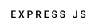

# Blabla-T - Chat application

Chat application based on Model View Controller architecture & created with :

        

## Table of contents 

* [General informations](#general-informations)
* [Organisation](#organisation)
* [Technologies](#technologies)
* [Setup](#setup)

## General informations

### Objectives 

* Create a chat in Node.js
* Install libraries with npm
* Use Express.JS
* Use Socket.IO

### Authors

* [Sarah Dade](https://github.com/SarahDade)  
* [Thibaut Fourneaux](https://github.com/FourneauxThibaut)  

## Organisation

### **Database structure**
         
<details>
  <summary>MVC structure</summary>

```

    .
    ├── Controllers/                    # Controller folder
    │   ├── messageController.js
    │   └── userController.js
    │   
    ├── Models/                          # Controller model
    │   ├── Message.js
    │   ├── model.js
    │   ├── Room.js                     # Homepage model
    │   └── User.js
    │
    ├── public/                         # Public folder
    │   ├── assets/
    │   │   └── css/ 
    │   │       └── normalize.css   
    │   │       └── style.css
    │   │     
    │   └── storage/
    │       └── logo-blablaT.svg   
    │
    ├── Routes/                         # Router folder
    │   │
    │   └─── users.js
    │
    ├── Views/                          # Views folder
    │   ├── authentification
    │   │   ├── signin.ejs
    │   │   └─── signup.ejs
    │   │     
    │   ├── users/                      # Errors folder
    │   │   ├── edit.ejs
    │   │   └── index.ejs
    │   │   └── show.ejs
    │   │    
    │   └── index.ejs/   
    │
    ├── .env                            # [! Gitignore] 
    ├── .gitignore
    ├── package-lock.json                   # dependency list
    ├── package.json
    └── README.md                       # --[*Your are here*]--
    .
 
```
</details> 


## Technologies
&nbsp;
Project is created with:
* Node: "v17.3.0"
* Mongoose: "^6.1.3"
* Socket.io: "^4.4.0"
* express: "^4.17.2"
* ejs: "^3.1.6"
* HTML 5
* CSS 3

## Setup

  **Create your Mongodb account before the following operations**

To run this project, install the dependencies using npm Install :

```
$ cd node-Chat 
$ npm install
$ node server.js
```

To establish database connection, you can either create a new ".Env" file or modify the existing one.


<p align="right">[<a href="#top">back to top</a>]</p>                                    


